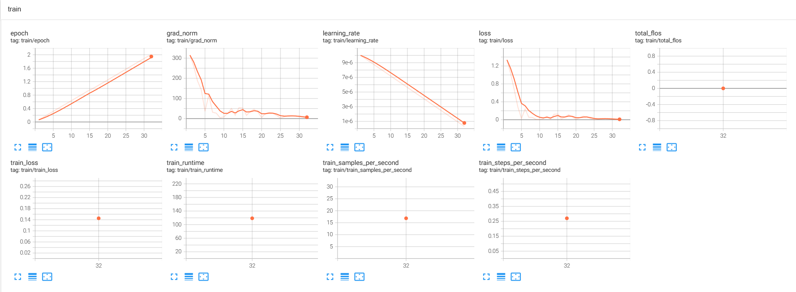

# HF-PPO

Huggingface TRL PPO训练示例，Policy/Reward/Value模型均基于Qwen3 LLM底座

## Train Reward

训练奖励模型：
```
python train_rm.py
```

Reward鼓励返回数字1，否定数字2~5
```
numbers=list('12345')
random.shuffle(numbers)
query=f'随机返回{",".join(numbers)}中的1个数字,只返回数字,不要说其他的.'
sample={
    'chosen':[{'role':'user','content':query},{'role':'assistant','content':'1'}],
    'rejected':[{'role':'user','content':query},{'role':'assistant','content':str(random.randint(2,5))}]
}
```

全参训练，少量样本即可收敛：




训练后的Reward模型，对返回1的对话打分正数，对返回非1的打分负数

```
python eval_rm.py
tensor([[2.8922]], device='cuda:0', grad_fn=<IndexBackward0>) tensor([[-4.5427]], device='cuda:0', grad_fn=<IndexBackward0>)
tensor([[2.9185]], device='cuda:0', grad_fn=<IndexBackward0>) tensor([[-4.4663]], device='cuda:0', grad_fn=<IndexBackward0>)
...
```


## Train PPO

进行PPO强化学习，利用上面的奖励模型，引导模型只返回1.

```
python train_ppo.py
```

收敛需要约400个episodes（问答对），通过超参调整抑制value收敛速度，让policy有足够的探索时间，逐步学会回答1来赢得高分reward，最终value模型也在末尾彻底收敛.

